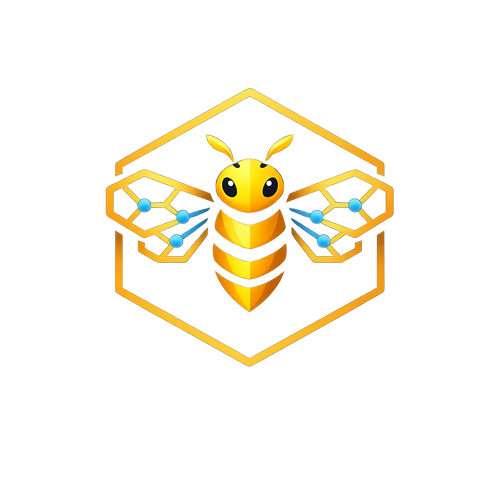

<p align="center">
  
</p>

<h1 align="center">The Hive Project 🐝</h1>

<p align="center"><em>A Polyglot Microservices Ecosystem for Events, Movies, and Streaming.</em></p>

<p align="center">
  
  
  
  
</p>

<p align="center">
  
  
  
</p>

<p align="center">
  
  
  
</p>

---

> **The Hive Project** is an ambitious engineering initiative to build a complete entertainment platform using a **Polyglot Microservices Architecture**. Instead of relying on a single language, "The Hive" utilizes the best tool for each domain—combining the transactional safety of **Spring Boot**, the high-concurrency performance of **.NET 10**, the dynamic consumer interfaces of **React**, the complex data-handling of **Angular**, and the event-driven nature of **Node.js**.

## 🏗️ System Architecture

The ecosystem is orchestrated via **Docker Compose**, with an **Nginx API Gateway** handling routing and **RabbitMQ** powering asynchronous, event-driven communication (utilizing the Transactional Outbox Pattern).

- **Gateway:** Nginx (Reverse Proxy)
- **Identity Provider:** Spring Boot 3 / Kotlin (Standalone IAM & S2S Auth)
- **Events Engine:** Spring Boot 3 / Kotlin (Core API)
- **Movies Engine:** .NET 10 / C# (High-Concurrency Seat Locking & Ticketing)
- **Consumer Portal:** React (Vite + TypeScript)
- **Admin Control Center (Planned):** Angular (TypeScript)
- **Notification Engine (Planned):** NestJS (Node.js)
- **Streaming (Planned):** NestJS (Node.js)

---

## 📦 Service Ecosystem

This repository acts as the **Central Hub**, orchestrating the following independent microservices via Git Submodules:

| Service Domain           | Tech Stack                                      | Repository & Docs                                                    |
| ------------------------ | ----------------------------------------------- | -------------------------------------------------------------------- |
| **Consumer Portal**      | **React**, TypeScript, Tailwind, TanStack Query | **[Hive-Forager-UI](https://github.com/Naveen2070/Hive-Forager-UI)** |
| **Admin Control Center** | **Angular**, TypeScript, RxJS, Material         | _Coming Soon_                                                        |
| **Core API** (Events)    | **Kotlin**, Spring Boot 3, PostgreSQL           | **[Hive-Event](https://github.com/Naveen2070/Hive-Event)**           |
| **Identity Service**     | **Kotlin**, Spring Boot 3, PostgreSQL           | **[Hive-Identity](https://github.com/Naveen2070/Hive-Identity)**     |
| **Movies API**           | **C#**, .NET 10, SQL Server                     | **[Hive-Movie](https://github.com/Naveen2070/Hive-Movie)**           |
| **Notification Engine**  | **Node.js**, NestJS, RabbitMQ                   | _Coming Soon_                                                        |
| **Streaming Engine**     | **Node.js**, NestJS, MongoDB                    | _Coming Soon_                                                        |

> **Security Note:** The backend microservices form a Zero-Trust network. They communicate via an industrial-grade **HMAC-SHA256** signature verification process for secure Service-to-Service (S2S) API calls, bypassing the need for JWTs internally.

---

## 🚀 Quick Start (Local Development)

Since this project uses **Git Submodules**, a standard clone will not work. Follow these steps to spin up the entire ecosystem.

### Prerequisites

- **Docker & Docker Compose** (Running)
- **Git**

### 1. Clone with Submodules

You must use the `--recurse-submodules` flag to pull the code for the backend and frontend simultaneously.

```bash
git clone --recurse-submodules https://github.com/Naveen2070/The-Hive-Project.git
cd The-Hive-Project
```

_Already cloned without the flag? Run `git submodule update --init --recursive` to fix it._

### 2. Configure Environment

Create a `.env` file in the root directory. This configures the databases, security layers, and message brokers across all containers:

```ini
# Database (Shared credentials for independent DBs: Postgres & SQL Server)
DB_USERNAME=admin
DB_PASSWORD=SuperSecretPassword123!

# JWT Security
JWT_SECRET=replace_this_with_a_very_long_secure_secret_key
JWT_EXPIRATION_MS=86400000

# Zero-Trust S2S Security
INTERNAL_SHARED_SECRET=replace_this_with_a_secure_s2s_key

# RabbitMQ Broker
RABBITMQ_USERNAME=publisher
RABBITMQ_PASSWORD=pub@2020
```

### 3. Ignite the Hive 🚀

Run the orchestration script:

```bash
docker-compose up --build -d
```

Access the services:

- **Frontend UI:** `http://localhost` (Proxied via Nginx on Port 80)
- **Core API (Events):** `http://localhost/api/events`
- **Identity API (Auth):** `http://localhost/api/auth`
- **Movies API:** `http://localhost/api/movies`
- **RabbitMQ Dashboard:** `http://localhost:15672` (Login: publisher/pub@2020)

---

## 🗺️ Project Roadmap

This project is evolving from a Monolith into a Distributed System using the **Strangler Fig Pattern**.

### ✅ Phase 1: The Core Foundation (Completed)

- [x] **Event Management:** CRUD operations for Events and Ticket Tiers.
- [x] **Monolithic Auth:** JWT Authentication and RBAC implementation.
- [x] **Frontend:** Responsive React UI with Dashboard and Wallet.
- [x] **Infrastructure:** Nginx Gateway and Docker Compose orchestration.

### ✅ Phase 2: Identity Crisis (Completed)

- [x] **Decomposition:** Extract Authentication & User Management from `Hive-Event`.
- [x] **Standalone IAM:** Build a dedicated Spring Boot Identity Service (`Hive-Identity`).
- [x] **Zero-Trust Networking:** Implement timestamped HMAC-SHA256 signatures for S2S communication.

### 🚧 Phase 3: The .NET Expansion (Backend Completed, UI Active)

- [x] **Microservice Setup:** .NET 10 Web API with SQL Server and Testcontainers.
- [x] **Seat Engine:** High-performance seat locking via Optimistic Concurrency (RowVersion).
- [x] **Reliability:** Implemented Transactional Outbox Pattern to guarantee RabbitMQ delivery.
- [x] **Webhooks:** Idempotent Stripe/Razorpay payment confirmation endpoints.
- [ ] **Frontend Integration:** Build interactive CSS Grid seat maps in the React Portal.
- [ ] **Checkout:** Integrate Stripe/Razorpay elements into the React UI.

### 🔌 Phase 4: Notifications & Admin Control Center (Next)

- [ ] **Notification Engine:** Spin up a NestJS worker to consume RabbitMQ queues and dispatch emails/WebSockets.
- [ ] **Admin UI:** Initialize an Angular + RxJS dashboard for super-admins to monitor the Hive ecosystem.

### 🕸️ Phase 5: Service Mesh & Discovery

- [ ] **Service Registry:** Implement Service Discovery (e.g., Consul or K8s DNS).
- [ ] **Tracing:** Implement Distributed Tracing (Zipkin/Jaeger/OpenTelemetry).

### 📺 Phase 6: Streaming

- [ ] **Streaming Service:** NestJS wrapper for video delivery.

---

## 👨‍💻 Developer Workflow

Thanks for checking out the code! 👋

This is a personal playground for experimenting (and breaking things!). 🧪
**I am not accepting contributions**, but please feel free to fork the repo and explore the architecture.

**For my future self (and curious minds), here is the "Submodule Dance" to update the code:**

1. **📍 Navigate:** Go into the specific service folder first (e.g., `cd services/hive-movie`).
2. **🌿 Checkout:** Make sure I'm on the main branch (`git checkout main`).
3. **💾 Code & Push:** Commit changes _inside_ that folder and push to its specific repository.
4. **🔗 Sync the Hub:** Come back to this root folder, run `git add services/...` and `git commit` to update the submodule pointer.

---

**Architected with ❤️ by [Naveen](https://github.com/Naveen2070)**
